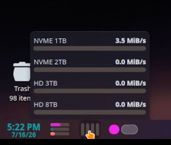

# Disk Speed Monitor Widget

[](https://kde.org/plasma-desktop/)
[](https://doc.qt.io/qt-6/qtqml-index.html)
[](https://github.com/PlasmaDrifter)
[](LICENSE)

A real-time disk read/write throughput speed gauge for KDE Plasma 6.

---

## Previews





---

## Features

- **Real-time**: disk Read and Write speed monitoring (MB/s)
- **Supports**: all active storage controllers (NVMe, SSD, HDD)
- **Transparent**: and compact display options
- **Low**: polling overhead

## Requirements

- **Environment**: KDE Plasma 6.0 or higher
- **Framework**: Qt6 QML / Plasma Applet API

## Installation

### Option 1: Git Clone (Recommended)
```bash
mkdir -p ~/.local/share/plasma/plasmoids/
git clone https://github.com/PlasmaDrifter/disk-speed.git ~/.local/share/plasma/plasmoids/local.widget.disk-speed
```

### Option 2: Plasma Package Installer
```bash
kpackagetool6 -i ~/.local/share/plasma/plasmoids/local.widget.disk-speed
```

Then right-click your desktop or panel $\rightarrow$ **Add Widgets...** and search for the widget name.

## Credits & License

- **Author / Maintainer**: PlasmaDrifter
- **License**: Licensed under the [GPLv2](LICENSE).
